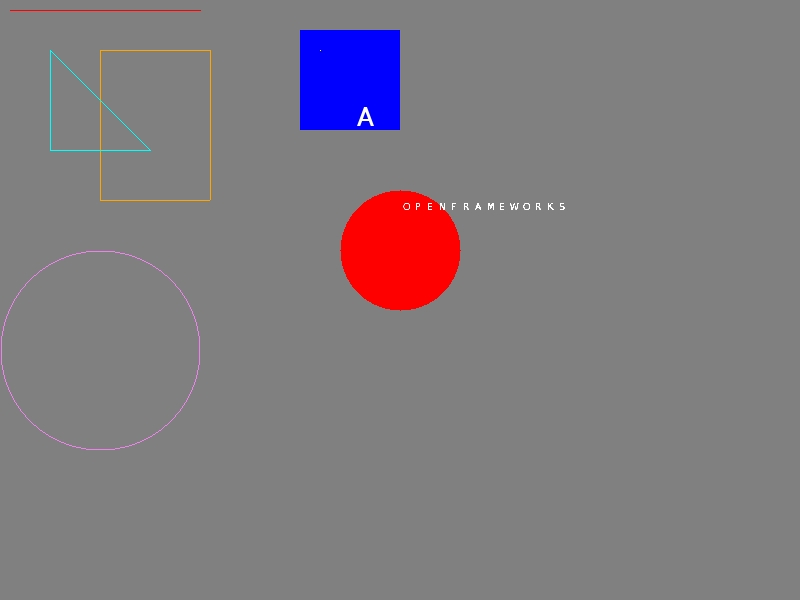

# ofPixelsShape

Useful for drawing simple shapes on ofPixels/ofImage out of the opengl context<br>



```c++
ofPixels pix;
ofPixelsShape shape;

/* Parameter: folder letter png, with background transparent and foreground white */
shape.create_font( "letter32x32" );

/* Parameter: [ofPixels|ofImage] [ofPoint xy1] [ofPoint xy2] [ofColor color] */
shape.draw_line(pix, ofPoint(10, 10), ofPoint(200, 10), ofColor::red);

/* Parameter: [ofPixels|ofImage] [ofRectangle rectangle] [ofColor color] [bool true=fill|false=nofill] */
shape.draw_rectangle(pix, ofRectangle(300,30,100,100), ofColor::blue);

/* Parameter: [ofPixels|ofImage] [ofPoint pos] [int radius] [ofColor color] [bool true=fill|false=nofill] */
shape.draw_circle(pix, ofPoint(400, 250), 60, ofColor::red);

/* Parameter: [ofPixels|ofImage] [ofPoint pos] [ofColor color] */
shape.draw_point(pix, ofPoint(320, 50), ofColor::yellow);

/* Parameter: [ofPixels|ofImage] [ofPoint xy1] [ofPoint xy2] [ofPoint xy3] [ofColor color] [bool true=fill|false=nofill] */
shape.draw_triangle(pix,  ofPoint(50,150), ofPoint(150,150), ofPoint(50,50), ofColor::cyan);

/* Parameter: [ofPixels|ofImage] [char letter] [ofPoint pos] [int size] */
shape.draw_char(pix,   'A', ofPoint(350,100));

/* Parameter: [ofPixels|ofImage] [string letters] [ofPoint pos] [int size] */
shape.draw_string(pix, "openframeworks", ofPoint(400,200), 12);
```
